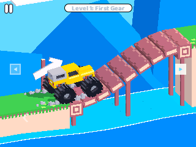
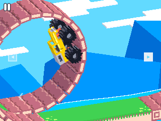
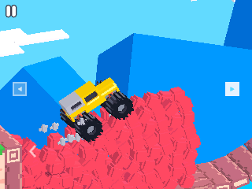
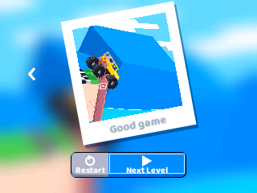
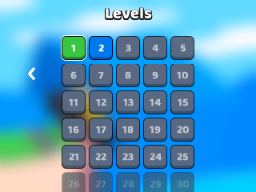

# NumDrive: Drive Mad for NumWorks

NumDrive is a Drive Mad style driving game for the NumWorks N0120 calculator.

157 levels of cars, physics puzzles, bridges and water, in a 240 KB app.

<p align="center">
   
   
   
</p>

## Install

1. Download `NumDrive.nwa` from the [latest release](https://github.com/Mason363/NumDrive/releases/latest).
2. Plug your calculator into a computer and open [my.numworks.com/apps](https://my.numworks.com/apps) in Chrome or Edge.
3. Upload `NumDrive.nwa` and send it to the calculator.
4. Open NumDrive from the home screen.

## Controls

| Key | Action |
| --- | --- |
| Right arrow | Drive forward |
| Left arrow | Brake and reverse |
| OK or Back | Pause |
| Arrows, then OK | Pick a button or a level |
| Back on a card | Level list |
| Home | Quit |

Your progress is saved on the calculator.

## Build

You need `arm-none-eabi-gcc` and Node.js.

```
make
```

The app is written to `output/device/numdrive.nwa`.

## Credits

Made by Mason Chen. Inspired by Drive Mad.

This is an unofficial fan game and is not affiliated with the makers of Drive Mad.
